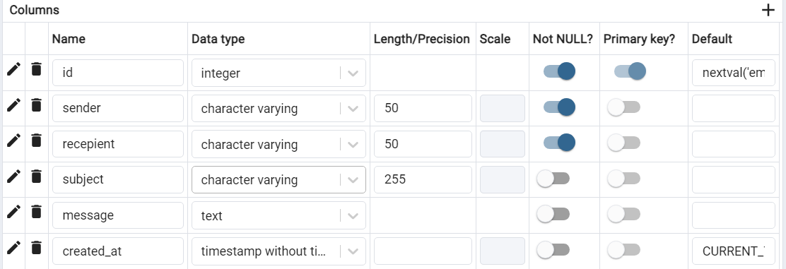

# Readme
This project provides `REST API` in PHP code (`without framework`) to send an email with authorization (using `Oauth2` *php-amqplib* library) security when sending email to the recepient. The emails are also will be stored into the DB (using `PostgreSQL`).

*Please take note that this project is foced on backend side, the frontend is there to run the program easily

## System Design
### Database
We only use 1 table for this DB which called by `emails`.
This table contains columns as we can see at image below.



**to be updated**


## Installation
### Requirements
- Install [PHP](https://www.php.net/manual/en/install.php) (Currently we're using v8.3)
- Install [Composer](https://getcomposer.org/download/)
- Install [PostgreSQL](https://www.postgresql.org/download/)
- Install [RabbitMQ](https://www.rabbitmq.com/docs/download) (but need to install [Erlang](https://www.erlang.org/downloads) first)
- Install Web Server [Apache](https://httpd.apache.org/download.cgi) / [PHP Server](https://marketplace.visualstudio.com/items?itemName=brapifra.phpserver) / [XAMPP](https://www.apachefriends.org/download.html)
- Setup [Google Oauth2](https://developers.google.com/identity/protocols/oauth2) `CLIENT_ID` and `CLIENT_SECRET` for authorization access
- Setup [Cacert](https://github.com/FilipQL/cacert.pem)

### Optional
- Install [Docker and Docker Compose](https://docs.docker.com/compose/install/)

## How to Run
### Repository
Clone the repo by running this command
```
git clone https://github.com/farizalhassyr/6d87dc154b0660a2ffa2b652ca9154fa.git
```
### Update the composer (optional)
Run this command in the terminal of `/src` directory to update the dependencies.
```
composer update
```
### Migration
Run this url in the browser to create new table `emails`.
```
http://localhost:3000/6d87dc154b0660a2ffa2b652ca9154fa/src/migrations/create_email_table.php
```

### Worker
- Run `Redis` that has been already installed
- Run worker in `/src/workes/email_worker.php` by using: 
```
php email_worker.php
```
- Or, alternatively can click this  [URL](http://localhost:3000/6d87dc154b0660a2ffa2b652ca9154fa/src/workers/email_worker.php) in the browser / postman


### Environment
We're using `vlucas/phpdotenv` for managing the environment.

Set `.env` file that will be placed in `./src` directory.
Example of my local `.env`:
```
BASE_URL=http://localhost:3000/6d87dc154b0660a2ffa2b652ca9154fa/src/ # adjust with your port/source location

# database
DB_HOST=
DB_NAME=
DB_USERNAME=
DB_PASSWORD=
DB_PORT=


# email
MAIL_HOST=
MAIL_USERNAME=
MAIL_NAME=
MAIL_PASSWORD=
MAIL_PORT=

# oauth2
CLIENT_ID=
CLIENT_SECRET=
REDIRECT_URL=
URL_AUTHORIZE=
URL_ACCESS_TOKEN=
URL_RESOURCE_OWNER_DETAIL= (optional)

# rabbitmq
RABBITMQ_HOST=
RABBITMQ_PORT=
RABBITMQ_USERNAME=
RABBITMQ_PASSWORD=
```

### Run the PHP with Webserver
Running ways are different for each Webserver, can check `guide` depending on what WebServer you are using.

The default homepage url is: 
```
http://localhost:[port number]/6d87dc154b0660a2ffa2b652ca9154fa/src/
```


## Running with Docker (optional)
### Dockerfile
- Set `Dockerfile` and `docker-compose.yml` based on [docker documentations](https://docs.docker.com/compose/compose-file/build/)
- Can check this [tutorial](https://semaphoreci.com/community/tutorials/dockerizing-a-php-application) also for complete example.